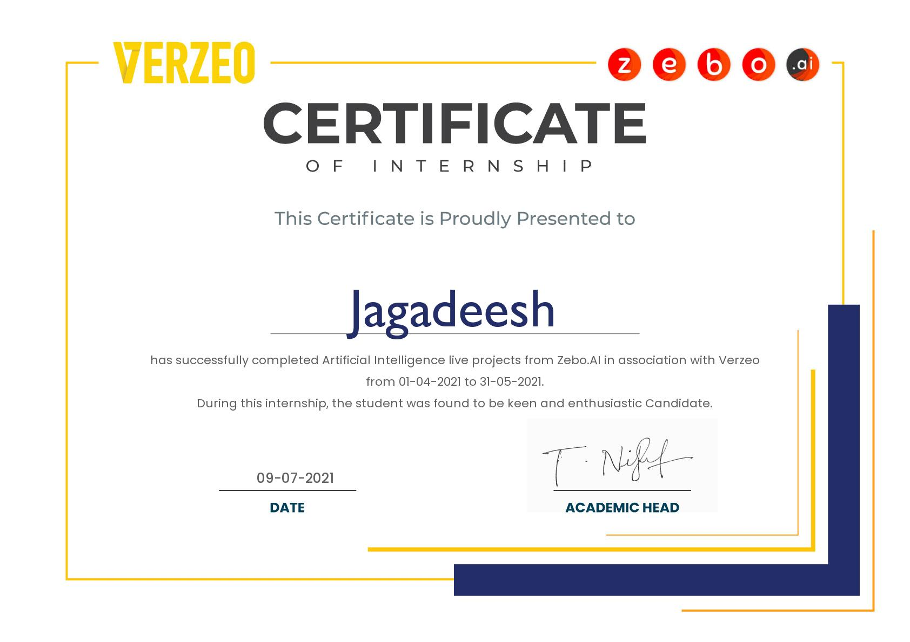
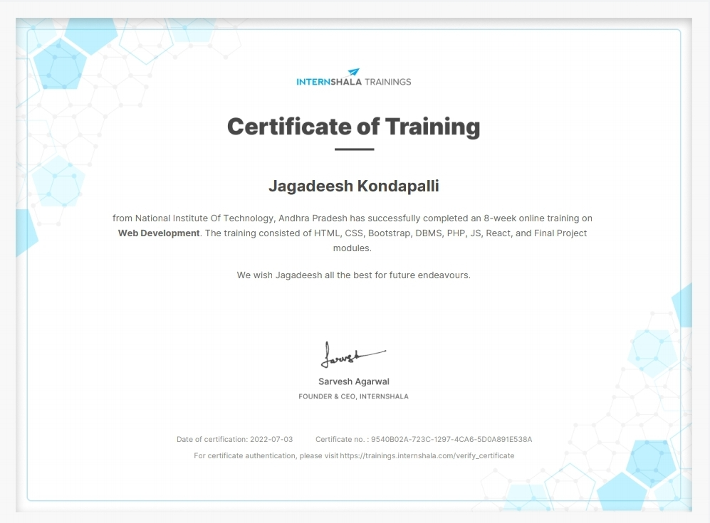

<!DOCTYPE html>
<html lang="en">
    <head>
        <meta charset="UTF-8">
        <meta http-equiv="X-UA-Compatible" content="IE-edge">
        <meta name="viewport" content="width=device-width, initial-scale=1.0">
        <title>Document</title>
        <!--=========CSS Files=======-->
        <link rel="stylesheet" href="styleportfolio.css">
        <link rel="stylesheet" href="color.css">
        <link rel="stylesheet" href="https://cdnjs.cloudflare.com/ajax/libs/font-awesome/6.1.1/css/all.min.css">
        <link rel="stylesheet" href="skins/color-1.css" class="alternate-style" title="color-1" 
        disabled>
        <link rel="stylesheet" href="skins/color-2.css" class="alternate-style" title="color-2" 
        disabled>
        <link rel="stylesheet" href="skins/color-3.css" class="alternate-style" title="color-3"
        disabled>
        <link rel="stylesheet" href="skins/color-4.css" class="alternate-style" title="color-4" 
        disabled>
        <link rel="stylesheet" href="skins/color-5.css" class="alternate-style" title="color-5" 
        disabled>
        <link rel="stylesheet" href="style-switcher.css">
    </head>
    <body class="dark">
        <!-- ======= Main container start========-->
        

           <!-- ======Aside start =====--> 
           

               

                    <a href="#">Portfolio</a>
               

               

                    
               

               <ul class="nav">
                    <li><a href="#home" class="active"><i class="fa fa-home"></i>Home</a></li>
                    <li><a href="#about"><i class="fa fa-user"></i>About</a></li>
                    <li><a href="#internships"><i class="fa fa-bars"></i>Internships</a></li>
                    <li><a href="#projects"><i class="fa fa-briefcase"></i>Projects</a></li>
                    <li><a href="#contact"><i class="fa fa-comments"></i>Contact</a></li>
               </ul>
           

           <!-- ======Aside end =====--> 
           <!-- ======= Main content start========-->
           

             <!--======Home section start =======-->
             <section class="home active section back-section " id="home">
                

                    

                        

                            <h3 class="hello">Hello, my name is KONDAPALLI JAGADEESH</h3>
                            <h3 class="my-profession">I'm a </h3>
                            <a href="#" class="btn">Download CV</a>
                        

                        

                            
                        

                    

                

             </section>
             <!--======Home section end =======-->
             <!--======About section start =======-->
             <section class="about section back-section " id="about">
                 

                     

                          

                              <h2>About Me</h2>
                          

                     

                     

                        

                            

                                

                                    <h3>I'm Jagadeesh and I'm Web Developer</h3>
                                    
This is my personal website. I am currently pursuing computer science and

                                    
engineering at National Institute of Technology Andhra Pradesh. I like to

                                    
consider myself a self-motivated, adaptable person with better than average

                                    
problem solving and communication skills.

                                

                            

                            

                                

                                    

                                       

                                            
Age :20

                                       

                                       

                                            
Website :jagadeeshkondapalli.github.io

                                       

                                       

                                            
Email :jagadeeshkondapalli1729@gmail.com

                                       

                                       

                                            
Degree :CSE

                                       
 
                                       

                                            
Phone :+91 9391352700

                                       
 
                                       

                                            
City :Kadapa

                                       
 
                                       

                                            
Place :Andhra pradesh, India

                                       
 
                                    

                                    

                                        

                                            <a href="#contact" data-section-index="1" class="btn hire-me">Hire Me</a>
                                        

                                    

                                

                                

                                    

                                        

                                            <h5>C</h5>
                                            

                                                

                                                
80%

                                            

                                        

                                        

                                            <h5>Python</h5>
                                            

                                                

                                                
70%

                                            

                                        

                                        

                                            <h5>Java</h5>
                                            

                                                

                                                
75%

                                            

                                        

                                        

                                            <h5>HTML/CSS</h5>
                                            

                                                

                                                
65%

                                            

                                        

                                        

                                            <h5>C++</h5>
                                            

                                                

                                                
80%

                                            

                                        

                                        

                                            <h5>Machine Learning</h5>
                                            

                                                

                                                
40%

                                            

                                        

                                    

                                

                    
                            

                            

                                

                                    <h3 class="title">Education</h3>
                                    

                                        

                                            

                                                 <!-- ==== Timeline item ====-->
                                                 

                                                     

                                                        <h3 class="timeline-date">
                                                          <i class="fa fa-calendar"></i>2020-2024
                                                        </h3>
                                                        <h4 class="timeline-title">National Institute of Technology, Andhra Pradesh--</h4>
                                                        
B.Tech, Computer Science and Engineering with 7.55 CGPA
                                                        
2022 - Present

                                                            
                                                        

                                                     

                                                 

                                                 <!-- ==== Timeline item ====-->
                                                 

                                                    

                                                       <h3 class="timeline-date">
                                                         <i class="fa fa-calendar"></i>2018-2020
                                                       </h3>
                                                       <h4 class="timeline-title">Narayana Olympiad Junior College, Andhra Pradesh--</h4>
                                                       
Class 11th and 12th with 98.117 JEE Percentile 
                                                        
and 9.7 GPA of 10 in State Board

                                                        
                                                       

                                                    

                                                 

                                                <!-- ==== Timeline item ====-->
                                                 

                                                    

                                                       <h3 class="timeline-date">
                                                         <i class="fa fa-calendar"></i>2014-2018
                                                       </h3>
                                                       <h4 class="timeline-title">Sri Chaitanya High School, Andhra Pradesh--</h4>
                                                       
 Class 7th to 10th with 9.8 GPA of 10 in State Board
                                                           
                                                       

                                                    

                                                 

                                            

                                        

                                    

                                

                            
                            

                        

                     

                 

             </section>
             <!--======About section end======-->
             <!--======Internships section start =======-->
             <section class="internships section back-section" id="internships">
                

                    

                         

                             <h2>Internships</h2>
                         

                    

                    

                        

                            <h2>My Internships and Certificates :</h2>
                        

                    

                    

                        <!--====== inner item section start======-->
                        

                             

                                

                                    
                                

                             

                        

                        <!--====== inner item section start======-->
                        <!--====== inner item section start======-->
                        

                             

                                

                                    
                                

                             

                        

                        <!--====== inner item section start======-->
                        <!--====== inner item section start======-->
                        

                             

                                

                                    
                                

                             

                        

                        <!--====== inner item section start======-->
                    
                    

                

             </section>
             <!--======internships section end =======-->
             <!--======Projects section start =======-->
             <section class="projects section back-section " id="projects">
                

                    

                         

                             <h2>Projects</h2>
                         

                    

                    

                        

                            <h2>My Last projects :</h2>
                        

                    

                    

                        

                            

                                 

                                    
                                

                            

                        

                        

                            

                                 

                                    
                                

                            

                       

                    

                

             </section>
             <!--======Projects section end =======-->
             <!--======Contact section start =======-->
             <section class="contact section back-section" id="contact">
                  

                     

                        

                            <h2>Contact Me</h2>
                        

                     

                     <h3 class="contact-title padd-15">Have You Any Questions ?</h3>
                     <h4 class="contact-sub-title padd-15">I'm At Your Service</h4>
                  

                  

                    <!--===== contact info item start ====-->
                    

                        
<i class="fa fa-phone"></i>

                        <h4>Call Me</h4>
                        
+91 9391352700

                    

                    <!--===== contact info item end ====-->
                    <!--===== contact info item start ====-->
                    

                        
<i class="fa fa-map-marker-alt"></i>

                        <h4>Address</h4>
                        
Kadapa, Andhrapradesh

                    

                    <!--===== contact info item end ====-->
                    <!--===== contact info item start ====-->
                    

                        
<i class="fas fa-hourglass-half"></i>

                        <h4>Available</h4>
                        
10AM to 10PM

                    

                    <!--===== contact info item end ====-->
                  

                  <h3 class="contact-title padd-15">SEND ME AN EMAIL</h3>
                  <h4 class="contact-sub-title padd-15">I'M VERY RESPONSIVE TO MESSAGES</h4>
                  <!-- ====== contact form ======-->
                  

                    

                        

                            

                                

                                    <input type="text" class="form-control" placeholder="Name">
                                

                            

                            

                                

                                    <input type="email" class="form-control" placeholder="Email">
                                

                            

    
                        

                        

                            

                                

                                    <input type="text" class="form-control" placeholder="Subject">
                                

                            

                        

                        

                            

                                

                                    <textarea name="" class="form-control" id="" placeholder="Message"></textarea>
                                

                            

                        

                        

                            

                                

                                    <button type="submit" class="btn">Send Message</button>
                                

                            

                        

                    

                  

             </section>
             <!--======Contact section end =======-->

           

           <!-- ======= Main content end=======-->
        

        <!-- ======= Main container end =======-->
        <!--=======style switcher start ======-->
        

            

               
            

            

                <i class="fas fa-moon"></i>
            

            <h4 >Theme colors</h4>
            

                
                
                
                
                
            
       
        

        <!--=======style switcher end =======-->

        <!--========JS File========-->
        
        
        
        
    </body>
</html>
